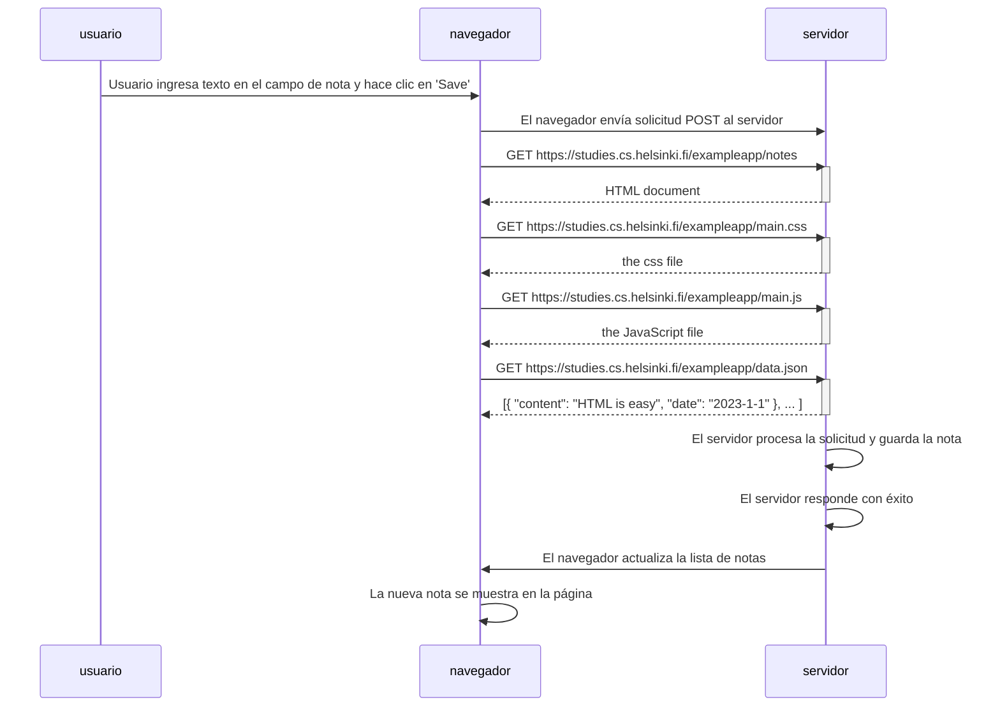

```mermaid
sequenceDiagram
participant usuario
participant navegador
participant servidor
usuario->>navegador: Usuario ingresa texto en el campo de nota y hace clic en 'Save'
navegador->>servidor: El navegador envía solicitud POST al servidor

navegador->>servidor: GET https://studies.cs.helsinki.fi/exampleapp/notes
activate servidor
servidor-->>navegador: HTML document
deactivate servidor

navegador->>servidor: GET https://studies.cs.helsinki.fi/exampleapp/main.css
activate servidor
servidor-->>navegador: the css file
deactivate servidor

navegador->>servidor: GET https://studies.cs.helsinki.fi/exampleapp/main.js
activate servidor
servidor-->>navegador: the JavaScript file
deactivate servidor

navegador->>servidor: GET https://studies.cs.helsinki.fi/exampleapp/data.json
activate servidor
servidor-->>navegador: [{ "content": "HTML is easy", "date": "2023-1-1" }, ... ]
deactivate servidor

servidor->>servidor: El servidor procesa la solicitud y guarda la nota
servidor->>servidor: El servidor responde con éxito
servidor->>navegador:El navegador actualiza la lista de notas
navegador->>navegador: La nueva nota se muestra en la página
```

