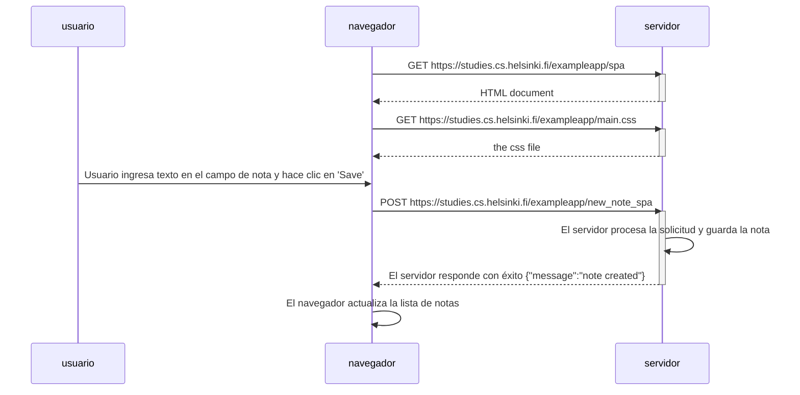

```mermaid
sequenceDiagram
participant usuario
participant navegador
participant servidor


navegador->>servidor: GET https://studies.cs.helsinki.fi/exampleapp/spa
activate servidor
servidor-->>navegador: HTML document
deactivate servidor

navegador->>servidor: GET https://studies.cs.helsinki.fi/exampleapp/main.css
activate servidor
servidor-->>navegador: the css file
deactivate servidor

usuario->>navegador: Usuario ingresa texto en el campo de nota y hace clic en 'Save'

navegador->>servidor: POST https://studies.cs.helsinki.fi/exampleapp/new_note_spa
activate servidor
servidor->>servidor: El servidor procesa la solicitud y guarda la nota
servidor-->>navegador: El servidor responde con éxito {"message":"note created"}
deactivate servidor

navegador->>navegador:El navegador actualiza la lista de notas
```
