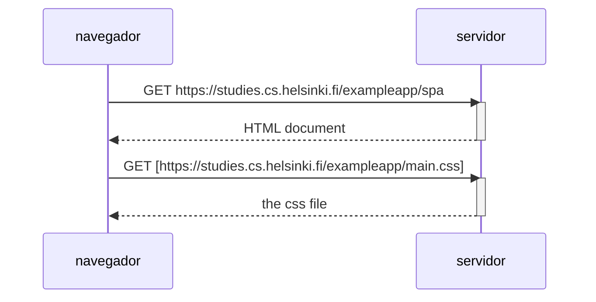

```mermaid
sequenceDiagram
participant navegador
participant servidor

navegador->>servidor: GET https://studies.cs.helsinki.fi/exampleapp/spa
activate servidor
servidor-->>navegador: HTML document
deactivate servidor

navegador->>servidor: GET [https://studies.cs.helsinki.fi/exampleapp/main.css]
activate servidor
servidor-->>navegador: the css file
deactivate servidor
```
